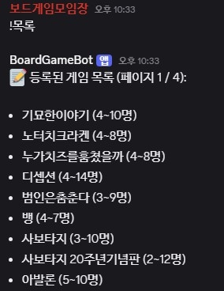
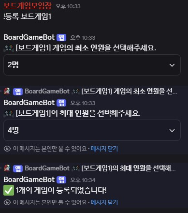
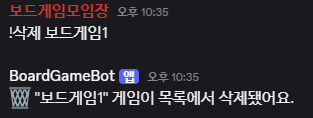

## BoardGameBot
보드게임 동호회 및 커뮤니티에서 보드게임 목록을 쉽고 편리하게 관리할 수 있도록 만든 디스코드 챗봇입니다.

## 📌 제작 계기
보드게임 동호회에서 카카오톡 공지글을 일일이 수정하며 게임 목록을 관리하는 걸 보았습니다.
이러한 번거로움을 덜고, 쉽게 보드게임 목록을 관리할 수 있도록 이 봇을 개발하게 되었습니다.

## ⚙️ 주요 명령어
!목록: 현재 등록된 보드게임 목록을 첫 페이지부터 보여줍니다.

!목록1, !목록2, ...: 보드게임 목록의 특정 페이지를 조회합니다.
예) !목록2

!등록 게임이름: 새로운 보드게임을 등록합니다. 인원수는 선택 박스에서 지정해야 등록이 완료됩니다.
예) !등록 카탄

!등록 게임이름1, 게임이름2, ...: 쉼표(,)로 여러 게임을 나열하면 한 번에 여러 개 등록됩니다.
예) !등록 루미큐브, 딕싯, 테라포밍

!삭제 게임이름: 등록된 보드게임을 삭제합니다. 이름이 정확히 일치해야 삭제됩니다.
예) !삭제 루미큐브

## 🛠️ 현재 구현된 기능
- 보드게임 개별/여러 개 등록 (,로 구분)
- 보드게임 삭제
- 보드게임 목록 페이징 조회
- 인원수 입력(select box)
- EC2 서버에서 24시간 구동 (pm2 활용)
- 단일 디스코드 서버 내장 JSON 파일로 목록 관리

## 🚧 앞으로 구현될 기능
- DB 연동: 여러 디스코드 서버별로 보드게임 리스트 개별 관리
- 검색 기능: 보드게임 이름으로 빠르게 찾기
- 카테고리 분류: 추리, 협동, 마피아 등 장르별 관리
- 보드게임 정보 수정: 인원수, 게임명 등 수정
- 권한 설정: 특정 역할만 관리 가능하게 제한
- 명령어 사용 가이드 제공 및 UI 개선

## 💻 사용 기술
- discord.js (디스코드 봇 개발)
- TypeScript
- Node.js
- EC2, pm2 (서버/프로세스 관리)
- (예정) DB 연동

## 🗂️ 사용법
아래 URL을 통해 디스코드 서버에 봇을 초대할 수 있습니다. (현재 단일 디스코드 서버 용으로 운영중)

https://discord.com/oauth2/authorize?client_id=1402272701422374922&permissions=126016&integration_type=0&scope=bot

봇 초대 후, 디스코드 내에서 명령어를 입력해 보드게임 목록을 관리할 수 있습니다.